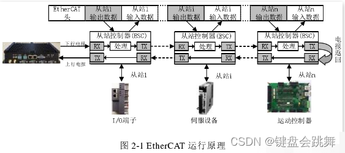
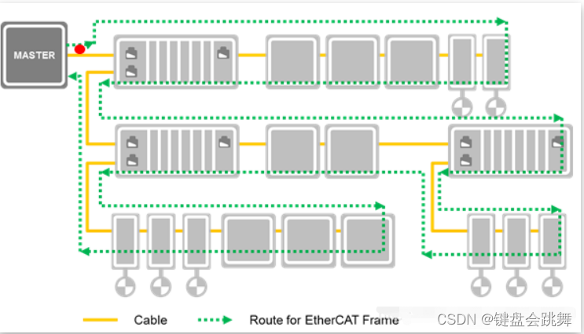
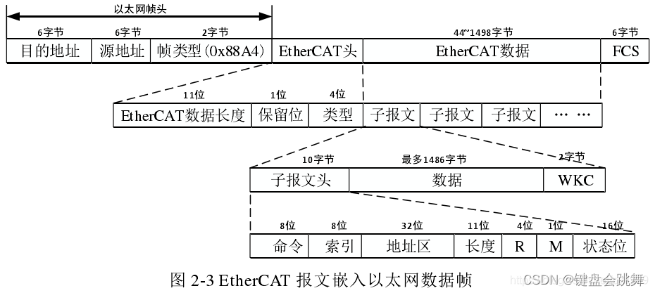
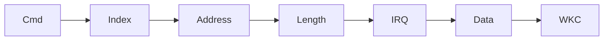
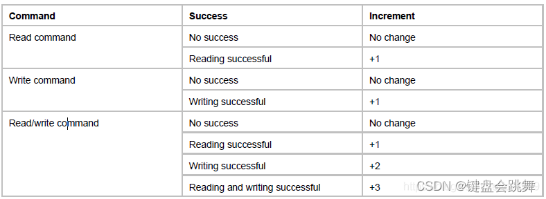
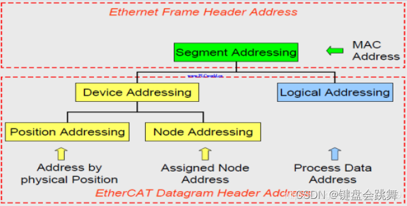
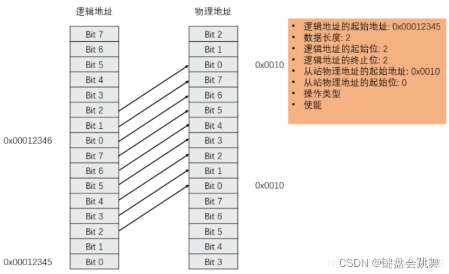
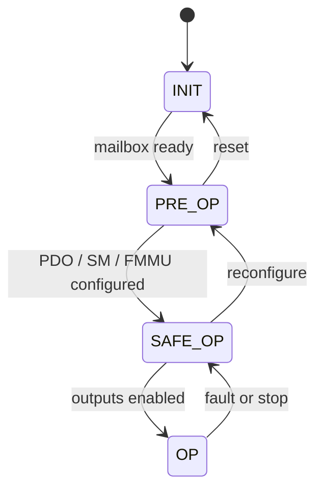
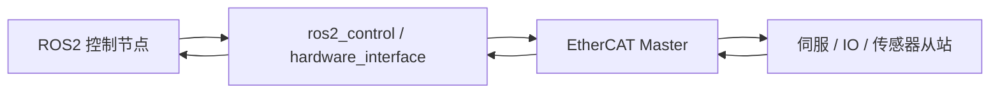

# EtherCAT 学习笔记

## 1. EtherCAT

`EtherCAT` 全称是 `Ethernet for Control Automation Technology`，是一种面向实时控制场景的工业以太网协议。它由 Beckhoff 推出，目标是在标准以太网物理层之上，实现低延迟、高同步精度和高带宽利用率的现场总线通信。

它常见于：

- 伺服驱动器和多轴运动控制
- IO 模块采集与输出
- 工业机器人关节控制
- CNC、测试测量与自动化产线
- ROS2 上层控制 + 实时总线执行的机器人系统

一句话理解：EtherCAT 不是普通 TCP/IP 通信，而是借用了以太网的物理链路和帧格式，用现场总线的方式组织实时过程数据。

## 2. 核心思想：On-the-Fly

传统以太网通信通常是目标设备收到完整数据帧后再解析处理。EtherCAT 的核心思想是 `On-the-Fly`，也就是数据帧经过从站时，从站硬件一边转发，一边读取或写入属于自己的数据区域。

这样做有两个关键收益：

- 多个从站可以共享同一个以太网帧完成数据交换
- 从站不需要完整缓存再转发，链路延迟非常低

可以把 EtherCAT 想成一列从主站出发的列车：每个从站只在自己的位置取走输出数据、放入输入数据，列车继续向后走；到达末端后，处理过的数据再回到主站。



## 3. 主站、从站与 ESC

EtherCAT 使用主从架构。

### 3.1 主站 Master

主站是唯一主动发起通信的节点，通常由工控机、嵌入式 Linux 控制器、运动控制器或软 PLC 实现。主站需要完成：

- 绑定实时网卡
- 扫描从站拓扑
- 读取从站身份和 ESI 信息
- 配置从站地址、FMMU、SM、PDO 映射和 DC 同步
- 切换从站状态机
- 周期发送和接收过程数据
- 检查 WKC、状态字和错误码

### 3.2 从站 Slave

从站可以是伺服驱动器、IO 模块、传感器模块等设备。从站内部通常有 `ESC`（EtherCAT Slave Controller），它负责在硬件层完成帧解析、数据交换和转发。

从站本地 MCU 或应用侧主要处理：

- 对象字典
- PDO 数据读写
- SDO 参数访问
- 设备状态机
- 厂商自定义功能

也就是说，实时链路的关键动作主要由 ESC 完成，这也是 EtherCAT 能做到低延迟的原因之一。

## 4. 物理层与拓扑

EtherCAT 常见物理层基于 100 Mbps 全双工以太网，工程中常见介质包括 CAT5e/CAT6 网线、RJ45 接头，以及更适合工业环境的 M12 接头。单段铜缆常按 100 m 以内设计。

常见拓扑包括：

- 线型：最常用，布线简单，从站依次串联
- 树型：适合设备分散的系统
- 星型：通常需要专用 EtherCAT 分支设备
- 环形冗余：主站使用双网口形成冗余链路，提高可靠性
- 混合拓扑：复杂产线中常见

从逻辑上看，EtherCAT 数据帧仍然像一个闭环一样传播。即使物理布线是线型、树型或分支结构，主站关心的仍然是帧从一个从站到下一个从站的处理顺序。



## 5. 刷新时间怎么估算

EtherCAT 的实时性不只是“网速 100 Mbps”这么简单，而是与过程数据长度、帧开销、从站数量和硬件延迟有关。

一个粗略估算方法：

```text
过程数据长度 = 所有从站周期输入输出数据之和
帧传输时间 = EtherCAT 帧总 bit 数 / 100 Mbps
总线刷新时间 ≈ 帧传输时间 * 2 + 从站硬件延迟
```

乘以 `2` 是因为数据需要经过从站链路后返回主站。实际系统还要考虑：

- 以太网最小帧长度
- EtherCAT 头部和 datagram 开销
- DC 同步相关字段
- 每个从站 ESC 的转发延迟
- 主站线程调度和网卡驱动抖动

例如只传输 1000 路数字量，过程数据大约是 `1000 / 8 = 125 Byte`，总线理论刷新时间可以做到几十微秒级。对于多轴伺服，假设每轴只传控制字、状态字、目标位置和实际位置，100 个轴的数据量也仍然可以压在很短的周期内。

这些计算适合作为理解实时性的上限估算，真正落地时还要看主站周期、实时内核、网卡、从站型号、PDO 映射和同步配置。

## 6. EtherCAT 帧与 Datagram

EtherCAT 数据通常直接封装在标准以太网帧里，常见 EtherType 是 `0x88A4`。一个 EtherCAT 帧可以包含一个或多个 datagram。



### 6.1 数据包整体结构

一个标准 EtherCAT 数据包通常由下面几部分组成：

**Ethernet 帧头（14 字节）**

- 目的 MAC 地址（6 字节）：接收方 MAC 地址。EtherCAT 直连主从链路里，常见情况是主站发出后由从站依次转发处理
- 源 MAC 地址（6 字节）：发送方 MAC 地址，一般是主站网卡地址
- 类型字段（2 字节）：标识上层协议类型，EtherCAT 直接封装时使用 `0x88A4`

**EtherCAT 帧头**

- 长度字段：标识后续 EtherCAT 数据区长度
- 类型字段：标识 EtherCAT 数据类型，常见过程数据帧会携带一个或多个 datagram

**EtherCAT Datagram（子报文）**

- EtherCAT 真正执行读、写、读写和寻址操作的基本单元
- 一个 Ethernet 帧中可以放多个 datagram
- 每个 datagram 可以访问不同从站、不同地址，或者同一段逻辑过程数据空间

**数据区**

- 写操作时，数据区携带主站写给从站的数据
- 读操作时，从站会在帧经过时把自己的输入数据插入到对应位置
- 数据区长度由 datagram 里的长度字段决定

**WKC（Working Counter）**

- 每个 datagram 尾部都有自己的 WKC
- 从站成功处理该 datagram 后会递增 WKC
- 主站通过比较期望 WKC 和实际 WKC 判断通信是否有效

**FCS（4 字节）**

- 以太网帧校验序列
- 通常由网卡硬件处理，用于检测帧传输错误

### 6.2 Datagram 字段结构

一个 EtherCAT datagram 通常包含：

- 命令字段 `Cmd`：1 字节，表示访问类型，例如读、写、读写、广播、逻辑地址访问等
- 索引字段 `Idx`：1 字节，用于主站匹配请求和响应，也方便诊断当前是哪一个子报文
- 地址字段 `Address`：4 字节，根据命令类型解释为位置地址、节点地址或逻辑地址
- 长度字段 `Len`：2 字节，表示后续数据区长度，同时包含循环、后续 datagram 等控制位
- 中断字段 `IRQ`：2 字节，用于事件或中断相关信息
- 数据区 `Data`：长度可变，是真正要读写的过程数据或寄存器数据
- 工作计数器 `WKC`：2 字节，记录该 datagram 被从站成功处理的次数

更细一点，一个 EtherCAT datagram 可以理解成下面这种结构：



其中 `Cmd` 决定访问方式，例如自动递增读写、配置地址读写、逻辑地址读写或广播操作；`Address` 的解释方式取决于命令类型；`Len` 决定 `Data` 区长度；`WKC` 则由经过的从站根据处理结果递增，主站最后用它做通信有效性检查。

EtherCAT 也可以通过 UDP/IP 封装，但实时控制链路通常更常见的是直接以太网帧方式。

## 7. WKC：调试时非常重要

`WKC` 是 `Working Counter`。从站成功处理某个 datagram 后，会按规则增加这个计数。主站会比较“期望 WKC”和“实际 WKC”，判断这次通信是否被正确处理。

WKC 不对时，常见方向包括：

- 从站数量或拓扑不符合预期
- 目标从站没有被正确寻址
- 从站没有进入对应状态
- FMMU 或 SM 配置不正确
- PDO 映射长度不一致
- 某个从站掉线或链路异常

在 EtherCAT 调试里，WKC 是很早就应该看的指标。它能帮你区分“主站程序还在跑”和“总线数据真的被从站处理了”。



## 8. 寻址方式

EtherCAT 的寻址可以分成设备寻址、逻辑寻址和广播寻址。理解寻址方式后，后面的 FMMU、PDO 映射会清楚很多。



### 8.1 位置寻址

位置寻址也叫自动递增寻址，主站按从站在链路中的物理顺序访问设备。它通常用于启动阶段扫描总线。

它的特点是简单，但依赖物理顺序。如果热插拔或链路异常导致顺序变化，定位故障会比较麻烦，所以不适合作为长期周期控制的主要方式。

### 8.2 节点寻址

节点寻址基于从站站地址访问设备。主站启动时可以给从站分配配置站地址，后续访问就不再完全依赖物理位置。

这种方式适合访问某个明确从站的 ESC 寄存器、邮箱区域或诊断信息。

### 8.3 逻辑寻址

逻辑寻址是过程数据通信的关键。主站把多个从站的本地物理地址映射到一片 32 位逻辑地址空间，然后周期通信时只访问这片逻辑空间。

好处是：

- 主站不用逐个从站访问过程数据
- 多个从站的数据可以连续排列
- 支持按 bit 级别映射
- 非常适合高频 PDO 过程数据

### 8.4 广播寻址

广播寻址会让所有从站都响应，常用于初始化、状态检查或全局控制类操作。

## 9. FMMU：逻辑地址到本地地址的映射

`FMMU` 是 `Fieldbus Memory Management Unit`，存在于从站 ESC 中，负责把主站的逻辑地址空间映射到从站本地物理地址空间。



主站启动时会配置 FMMU，典型配置内容包括：

- 逻辑地址起始位置
- 映射长度
- 起始 bit 和结束 bit
- 从站本地物理地址
- 操作方向：读、写或读写
- 是否使能

配置完成后，主站访问逻辑地址时，从站 ESC 会判断这段逻辑地址是否命中自己的 FMMU。如果命中，就在帧经过时执行读写。

工程上可以这样理解：

- FMMU 解决“主站逻辑过程数据映像”和“从站 ESC 本地存储区”之间的地址翻译
- PDO 能被连续、高效地打包进一个周期帧，背后主要靠 FMMU

## 10. SM：同步管理器

`SM` 是 `Sync Manager`，用于管理主站和从站应用侧对 ESC 存储区的访问，避免双方同时读写导致数据不一致。

常见用法可以分成两类：

| 通道 | 常见用途 | 特点 |
| --- | --- | --- |
| `SM0` / `SM1` | 邮箱数据 | 常用于 SDO、CoE 等非周期通信 |
| `SM2` / `SM3` | 过程数据 | 常用于 RxPDO、TxPDO 周期数据 |

一般可以这样记：

- 邮箱通信主要依赖 SM 管理缓冲区
- PDO 通常由 SM 和 FMMU 配合完成
- SM 负责数据一致性和通知机制，FMMU 负责逻辑地址映射

## 11. EtherCAT 状态机

EtherCAT 从站有明确的状态机，常见状态包括：

- `INIT`：初始化状态，基础通信可用
- `PRE-OP`：预操作状态，可以进行邮箱通信和参数配置
- `SAFE-OP`：安全操作状态，输入过程数据可用，输出通常还不生效
- `OP`：操作状态，周期过程数据正常交换，设备进入运行阶段

典型启动流程如下：



如果从站无法进入 `OP`，优先检查：

- ESI 文件是否匹配设备固件
- 邮箱通信是否正常
- PDO 映射长度是否一致
- SM/FMMU 是否配置正确
- DC 同步是否失败
- AL Status Code 是否提示具体错误
- WKC 是否达到期望值

## 12. 对象字典、PDO 与 SDO

很多 EtherCAT 设备支持 `CoE`，也就是 `CANopen over EtherCAT`。它不是说底层还在跑 CAN 总线，而是借用了 CANopen 的对象字典、PDO、SDO 和设备模型。

对象字典用 `Index:SubIndex` 表示设备参数和过程变量，例如：

- `0x6040:00`：Controlword
- `0x6041:00`：Statusword
- `0x6060:00`：Modes of Operation
- `0x6061:00`：Modes of Operation Display
- `0x607A:00`：Target Position
- `0x6064:00`：Position Actual Value

### 12.1 PDO

`PDO` 是 `Process Data Object`，用于周期实时数据交换。

常见 PDO 数据包括：

- 主站到从站：控制字、目标位置、目标速度、目标转矩、数字输出
- 从站到主站：状态字、实际位置、实际速度、实际转矩、数字输入

PDO 的特点：

- 周期发送
- 固定映射
- 低延迟
- 适合控制循环

在主站视角里，PDO 往往已经被映射到本地输入输出缓冲区。循环里做的事情通常是：写输出缓冲区、发送过程数据、接收过程数据、读输入缓冲区。

### 12.2 SDO

`SDO` 是 `Service Data Object`，用于非周期参数访问，通常通过邮箱通信实现。

常见用途：

- 读取设备型号、版本和错误码
- 配置工作模式
- 设置加速度、限位、滤波等参数
- 配置或确认 PDO 映射
- 保存参数到设备非易失存储

不要在高频控制循环里频繁使用 SDO。实时控制量放 PDO，初始化和诊断参数放 SDO。

## 13. CoE 与 CiA 402

伺服驱动器中常见 `CiA 402` 设备模型。它定义了驱动器控制字、状态字、工作模式和状态切换逻辑。

这里要区分两层状态机：

- EtherCAT 状态机：从站是否已经进入 `OP`
- CiA 402 状态机：伺服是否已经可以上使能并执行运动

从站进入 `OP` 只说明总线周期数据通了，不代表电机一定会动。电机是否运动还取决于：

- `Controlword` 是否按流程写入
- `Statusword` 是否反馈到目标状态
- 工作模式是否正确
- 驱动器是否报警
- 安全输入、急停、抱闸是否满足
- 目标位置、速度或转矩是否有效

典型伺服上电使能流程：

1. 切 EtherCAT 从站到 `OP`
2. 设置 `Modes of Operation`
3. 写 `Shutdown`
4. 写 `Switch On`
5. 写 `Enable Operation`
6. 周期写目标值并读取反馈值

## 14. 分布式时钟 DC

`DC` 是 `Distributed Clocks`，用于多个从站之间的高精度同步。主站通常选一个支持 DC 的从站作为参考时钟，然后测量链路延迟，让其他从站对齐到同一时间基准。

在多轴控制里，DC 非常重要。没有稳定同步时，通信看起来可能是通的，但多轴动作会出现周期抖动、轨迹不同步或跟随误差变大。

调试 DC 时重点看：

- 哪个从站是参考时钟
- 从站是否支持 DC
- 同步周期是否等于控制周期
- 主站线程周期是否稳定
- 同步误差是否在允许范围内
- 是否存在链路延迟补偿失败

## 15. 主站协议栈与开发路线

常见开源主站协议栈包括：

| 协议栈 | 特点 | 适合场景 |
| --- | --- | --- |
| `SOEM` | 轻量、跨平台、容易上手 | 快速验证、小型机器人、嵌入式主站 |
| `IgH EtherCAT Master` | Linux 生态成熟，支持实时系统集成 | 工控机、产线设备、ROS2 底层驱动 |

一个典型主站程序的流程：

```text
绑定网卡
扫描从站
读取从站信息
配置 PDO / SM / FMMU
配置 DC 同步
切换 INIT -> PRE-OP -> SAFE-OP -> OP
进入周期循环
    写 RxPDO 输出
    send process data
    receive process data
    读 TxPDO 输入
    检查 WKC 和状态
异常时降状态或重新初始化
```

如果和 ROS2 集成，比较常见的架构是：



ROS2 负责上层控制、规划和状态发布，EtherCAT 负责底层实时过程数据交换。真正做项目时，需要特别注意实时线程、内存分配、日志输出、锁竞争和 DDS 通信对控制周期的影响。

## 参考资料

本文图片来自以下参考文章，内容做了重新整理和归纳。

- [工业以太网协议---EtherCAT](https://blog.csdn.net/2301_80079642/article/details/158702739)
- [EtherCat：打通EtherCat奇经八脉（一）](https://blog.csdn.net/tjcwt2011/article/details/140841724)
- [EtherCAT解析，让你全面了解EtherCAT](https://blog.csdn.net/weixin_48911153/article/details/143053980)
