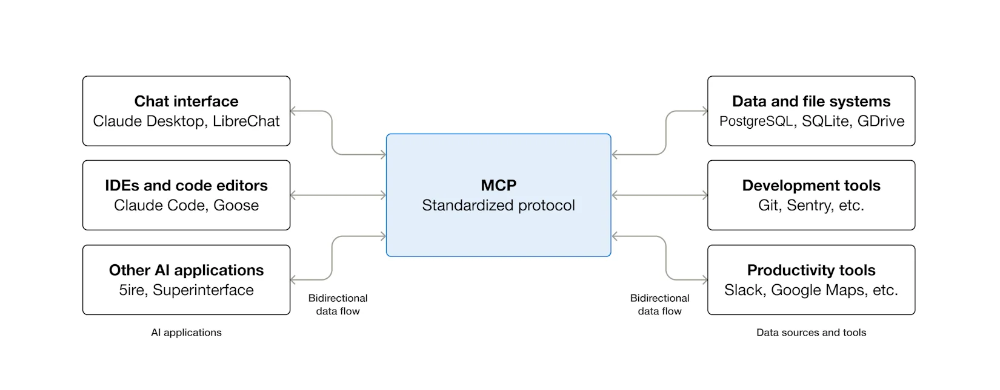

# MCP 开发入门：从协议理解到服务端落地

随着 `Copilot`、`Codex` 和各种 Agent 工具逐步普及，一个问题越来越实际：模型能不能稳定接入外部能力，而不是只靠提示词“猜”。

如果没有统一协议，模型很容易遇到这些问题：

- 不知道项目里的真实接口和环境状态
- 拿不到最新文档、配置和数据
- 无法安全调用本地工具或外部服务

`MCP` 的意义，就是在模型和工具之间加一层标准化协议，让 Agent 不只是会聊天，还能**发现能力、读取上下文、调用工具、完成真实任务**。

这篇文章主要回答 4 个问题：

1. `MCP` 到底解决了什么问题
2. `Host`、`Client`、`Server` 各自负责什么
3. 一次 `MCP` 调用链路是怎么跑起来的
4. 一个 `MCP Server` 应该怎么开发、调试和限权

## 1. MCP 是什么

`MCP` 全称是 `Model Context Protocol`，可以把它理解成 AI Agent 时代的“工具接入标准”。

官方常用一个比喻：**MCP 就像 AI 应用的 `USB-C` 接口**。  
以前每接一个外部系统，都要做一次定制集成；有了 `MCP` 之后，只要宿主支持 `MCP Client`，就能按统一方式去连接数据源、工具和工作流。

从工程视角看，`MCP` 本质上是在做两件事：

- 标准化模型如何获取外部上下文
- 标准化模型如何调用外部能力

三者关系可以简单理解成：

- **LLM**：负责理解意图和生成决策
- **MCP Client**：负责连接、协商和消息收发
- **MCP Server**：负责暴露真实能力

所以，`MCP` 特别适合接入这些能力：

- 本地命令行能力
- 内部 API
- 数据库查询
- 文档检索
- 浏览器自动化
- CI/CD、监控、工单等工程系统

## 2. Host、Client、Server 分别做什么

`MCP` 不是简单的“客户端连服务端”，而是更接近三层关系：

- `Host`：宿主应用，比如 `Claude Desktop`、`VS Code`、`ChatGPT` 这类支持 `MCP` 的 AI 应用
- `Client`：由宿主创建，用来和某个具体 `MCP Server` 建立连接的协议客户端
- `Server`：由开发者实现的能力提供方，负责暴露工具、资源和提示模板

这个拆分的核心意义在于责任边界清晰：

- `Host` 负责用户交互、权限控制和整体调度
- `Client` 负责协议握手、连接管理和消息传递
- `Server` 负责把数据库、命令、API、文档等真实能力包装出来

站在一次工具调用的视角，`Host` 往往会完成这样一条链路：

1. 接收用户问题
2. 选择是否调用某个工具
3. 组织参数
4. 通过 `Client` 调用 `Server`
5. 解析结果
6. 再继续当前对话

所以可以说，**MCP 统一的不只是“工具接口”，而是 Agent 调用外部能力的整条工作链路**。



## 3. MCP 协议到底在标准化什么

如果把 `MCP` 拆开看，可以分成两层：

- `transport layer`：消息怎么传，常见是 `stdio` 或 `Streamable HTTP`
- `data layer`：消息说什么，底层基于 `JSON-RPC 2.0`

这也是理解协议时最重要的一点：

- 传输层解决“**怎么连**”
- 数据层解决“**怎么说**”

### 3.1 JSON-RPC 2.0：约定统一消息格式

`MCP` 在数据层大量依赖 `JSON-RPC 2.0`。从开发角度看，它最大的好处是：客户端和服务端交换的消息结构非常统一。

常见消息里，通常会反复看到这些字段：

- `jsonrpc`
- `method`
- `id`
- `params` / `result` / `error`

例如：

- `initialize`：初始化并协商能力
- `tools/list`：列出服务端提供的工具
- `tools/call`：调用具体工具

也就是说，`MCP` 不是“随便传一段 JSON”，而是在统一的 RPC 语义之上，约定了一套面向 Agent 的能力模型。

### 3.2 典型调用链路

从实现和排错角度看，`MCP` 连接不是“连上就直接调工具”，而是先走一轮初始化。

典型流程可以概括成这几步：

1. 建立连接
2. 执行 `initialize`
3. 完成能力协商
4. 进入正常会话
5. 执行 `tools/list`、`tools/call` 等请求

这一步非常容易被忽略，但很多“工具调不起来”的问题，根源都不在业务代码，而是在初始化阶段：

- 协议版本不兼容
- 客户端不支持服务端声明的能力
- 服务端没有正确暴露 `tools`、`resources`、`prompts`

如果在调试时总盯着工具实现本身，往往会绕很久。

### 3.3 Tools、Resources、Prompts 分别做什么

一个 `MCP Server` 最常见的能力通常分成 3 类：

| 类型 | 作用 | 适合什么场景 |
| --- | --- | --- |
| `Tools` | 让模型发起动作 | 查数据、执行命令、调用 API |
| `Resources` | 给模型读内容 | 文档、配置、日志、规范说明 |
| `Prompts` | 复用提示模板 | 固定工作流、标准化问答、操作指引 |

从工程使用角度看：

- `Tool` 偏“能做事”
- `Resource` 偏“能读到”
- `Prompt` 偏“会怎么做”

如果只是做入门版服务，通常先把 `Tools` 做好就够了；如果要提升 Agent 的稳定性，再逐步补 `Resources` 和 `Prompts`。

### 3.4 MCP的其他能力

实际联调里，下面这些能力也很有用：

- `sampling`：让服务端在执行过程中回到客户端，请求模型或用户补一步信息
- `roots`：让客户端告诉服务端当前工作区或允许访问的根目录
- `logging`：把服务端日志通过协议交给客户端展示

这意味着更完整的 `MCP` 流程，往往不是“调一个函数就结束”，而是：

1. 用户发起任务
2. 客户端调用某个工具
3. 服务端发现信息不足或需要确认
4. 再向客户端请求补充输入
5. 最后继续执行并返回结果

理解这一层之后，就更容易明白为什么 `MCP` 不只是“函数调用协议”，而是一个面向 Agent 工作流的交互协议。

## 4. 一个 MCP Server 应该怎么开发

如果先把目标收敛到“做一个能跑、能调、能集成的服务”，通常按下面 5 步推进就够了。

### 4.1 先定义服务边界

第一步不要急着写代码，而是先问清楚：

- 这个服务到底要给 Agent 什么能力
- 是只读，还是读写
- 结果是否有副作用
- 哪些操作必须限制权限

举个例子，如果要做一个“项目知识库 MCP”，它的最小能力可能只有：

- 根据关键词搜索文档
- 读取指定文档内容
- 返回推荐阅读路径

而不是一上来就做成“能改库、能发版、能删数据”的全能服务。

### 4.2 选传输方式

本地开发最常用的是：

- `stdio`
- `Streamable HTTP`

一般可以这样选：

- 本地 IDE、桌面客户端、本机 Agent：优先 `stdio`
- 远程部署、多用户共享、企业内网系统：考虑 `HTTP`

不少早期原理文章会用 `SSE` 来讲远程流式通信，这对理解“服务端持续推送消息”很有帮助；但在实际开发里，更重要的是先分清楚：**本地集成优先 `stdio`，远程部署优先标准 HTTP 方案**。

### 4.3 参数和返回值都要“强约束”

对 Agent 来说，schema 不只是校验规则，本身也是提示信息的一部分。

建议优先做这些事：

- 给每个字段写清楚描述
- 用枚举约束可选值
- 明确必填字段
- 对路径、ID、日期做格式校验
- 返回结构化结果，而不是一整段自然语言

返回值最好同时兼顾两件事：

- 机器可继续处理
- 人类可直接看懂

### 4.4 最小示例

下面是一个偏入门的 `Node.js` 示例，暴露一个最简单的工具：根据主题返回一段开发建议。

```ts
import { McpServer } from "@modelcontextprotocol/sdk/server/mcp.js";
import { StdioServerTransport } from "@modelcontextprotocol/sdk/server/stdio.js";
import { z } from "zod";

const server = new McpServer({
  name: "dev-notes",
  version: "1.0.0",
});

server.tool(
  "summarize_topic",
  {
    topic: z.string().describe("需要总结的技术主题"),
  },
  async ({ topic }) => {
    const content = `主题 ${topic} 的建议：先梳理边界，再拆输入输出，最后补调试与错误处理。`;

    return {
      content: [
        {
          type: "text",
          text: content,
        },
      ],
    };
  }
);

const transport = new StdioServerTransport();
await server.connect(transport);
```

这段代码已经覆盖了 `MCP Server` 的基本骨架：

- 创建一个 `McpServer`
- 注册一个工具
- 用 `zod` 描述参数
- 返回模型可消费的内容
- 通过 `stdio` 启动服务

### 4.5 FastMCP

`FastMCP` 也是很常见的入门路径。它的思路和上面的 TypeScript 示例很像：创建服务、注册工具、选择传输方式，然后启动。

```python
from mcp.server import FastMCP

app = FastMCP("web-search")

@app.tool()
async def web_search(query: str) -> str:
    """
    搜索互联网内容
    """
    return f"当前搜索内容：{query}"

if __name__ == "__main__":
    app.run(transport="stdio")
```

这类高层封装的价值在于：可以先把工具边界、参数和返回值设计好，再逐步往里补真实业务逻辑，而不是一开始就陷进底层协议细节。

### 4.6 服务端之外，客户端怎么接

很多人第一次接触 `MCP` 时，会把注意力都放在 Server 上；但真正上线时，开发者通常还要面对客户端如何连接、初始化、列工具、再调用工具。

一个最小客户端流程通常就是：

1. 创建 `ClientSession`
2. 建立 `stdio` 或 `HTTP` 连接
3. 执行 `initialize`
4. 调用 `list_tools`
5. 根据工具描述决定是否执行 `call_tool`

如果开发者要自己做 Agent，而不是只把服务接进现成宿主，这条链路一定要亲手跑通一次。因为只有真正写过客户端，才会更清楚：

- 模型到底能看到哪些工具描述
- 参数 schema 会怎样影响工具选择
- 调用失败时该由哪一层做兜底

## 5. 调试和联调时，优先看这几件事

### 5.1 先用 MCP Inspector

调试 `MCP` 时，最实用的习惯之一是：**先脱离具体宿主，用 `MCP Inspector` 单独验证服务本身**。

它适合先检查这些问题：

- 能不能连上
- 初始化和能力协商是否正常
- `tools/resources/prompts` 有没有正确暴露
- 参数 schema 和返回结果是否符合预期

本地开发时可以先跑：

```bash
npx @modelcontextprotocol/inspector node path/to/server/index.js
```

先把协议链路跑通，再接入 IDE 或桌面客户端，定位问题会快很多。

### 5.2 常见问题清单

刚开始接服务时，最常见的问题通常不是“代码不会写”，而是这些基础细节没处理好：

- 工具描述太短，模型不会选或不会传参数
- 初始化没协商成功，导致后续工具不可见
- 错误返回只有 `Internal Error`，模型没法继续决策
- 路径、环境变量或权限配置不对，客户端根本连不上

如果接入宿主后始终不工作，排查顺序建议如下：

1. 先确认命令、路径和环境变量
2. 再确认服务能否独立跑通
3. 用 `Inspector` 验证初始化和工具暴露
4. 最后再回到具体宿主里查集成问题

### 5.3 MCP配置

把服务接到 `Claude Desktop`、`VS Code` 或其他宿主时，问题往往不在工具实现本身，而在配置层。

以本地 `stdio` 服务为例，宿主侧通常要配置：

- 启动命令
- 参数列表
- 环境变量
- 工作目录

一个很常见的本地配置大致会像这样：

```json
{
  "mcpServers": {
    "my-server": {
      "command": "uv",
      "args": ["run", "web_search.py"]
    }
  }
}
```

如果命令能在终端里跑，但在宿主里始终连不上，优先排查这几类问题：

- 宿主使用的路径与预期路径不一致
- 虚拟环境依赖没有被正确继承
- 必要的环境变量没有传进去
- 服务启动后立刻报错，但日志没有被及时看到

## 6. 安全和可观测性

`MCP` 一旦接入真实系统，就不再只是演示代码。尤其是带副作用的工具，比如：

- 执行 shell
- 写数据库
- 发消息
- 触发部署

一定不要默认“模型会自己谨慎”。

至少要考虑这些基础能力：

- 参数校验
- 权限控制
- 超时处理
- 重试策略
- 日志审计
- 敏感信息脱敏

如果服务跑在远程环境里，还要额外考虑：

- 身份认证
- 来源校验
- 会话隔离
- 速率限制

有一个非常容易踩坑的细节也值得单独提醒：**本地 `stdio` 服务器不要往 `stdout` 打日志**。  
因为 `stdout` 承载的是协议消息本身，日志一旦混进去，就可能直接把通信流污染掉。

更稳妥的做法是：

- 本地 `stdio` 场景优先写到 `stderr`
- 或通过协议日志能力交给客户端展示

### 6.1 提升可用性

从实践角度看，`MCP` 还有两个经常被忽略、但非常实用的点：

- **生命周期管理**：在服务初始化时建立数据库连接、缓存、上下文；在服务关闭时统一清理资源
- **人工确认或补充输入**：在真正执行高风险动作前，让客户端或用户明确确认

这两类能力非常适合下面这些场景：

- 删除文件前先确认
- 触发部署前先二次审批
- 在服务启动时预热缓存或加载配置
- 在服务关闭时统一落日志和审计信息

如果把 `MCP` 只理解成“暴露几个工具”，就很容易低估它在真实工作流里的价值；而一旦把生命周期、确认流程和日志都接上，整个系统的可控性会明显提高。

## 总结

`MCP` 可以理解成 AI Agent 的工具协议层。它最值得投入的地方，不是概念本身，而是它能把“模型能力”和“真实系统能力”真正接起来。
