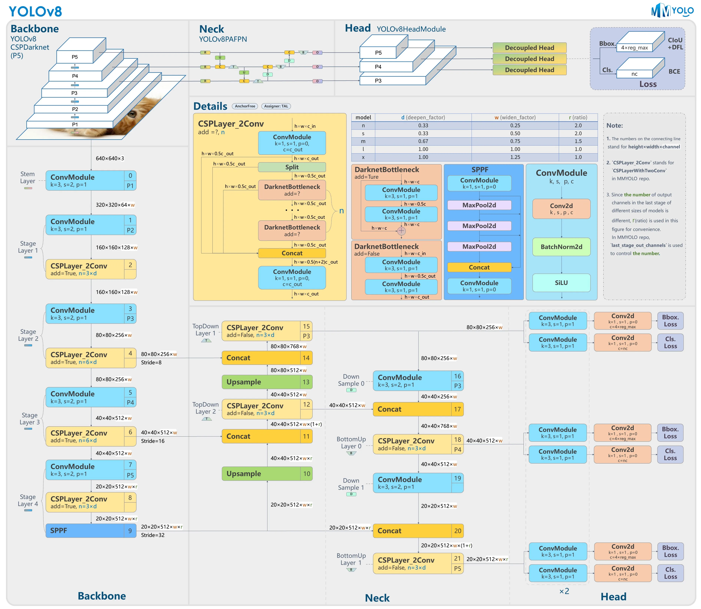
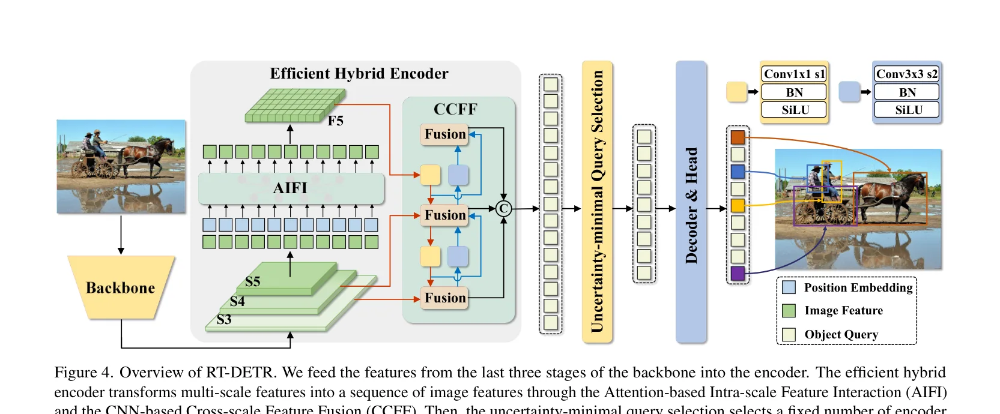

# YOLO 与 RT-DETR 对比：速度、精度与部署选型

## 1. 引言

最近在做货物托盘检测由于需要商用，模型初选主要落在 `YOLO` 和 `RT-DETR` 两条路线之间(两者均为Apache-2.0 license)。两者都能完成目标检测任务，但它们背后的设计目标并不一样：`YOLO` 更偏向成熟、稳定、易部署的实时检测范式，`RT-DETR` 则代表了把 `DETR` 思路推向实时场景的一类新方案。  

## 2. 两者定位

### 2.1 YOLO 的定位

`YOLO (You Only Look Once)` 最早在 `2015` 年提出，核心思路是把目标检测从“先找候选区域、再逐个分类”的两阶段流程，改成“直接在整张图上一次性完成类别与位置预测”的单阶段回归问题。也正因为这个出发点，`YOLO` 从一开始就带有非常强的实时检测导向。

从发展脉络看，`YOLO` 并不是单一模型，而是一条持续向“更快、更准、更容易部署”演进的工程路线：

- `YOLOv1` 用网格划分整图并直接回归边界框，奠定了单阶段实时检测的基本范式
- `YOLOv5` 之后，这条路线在工程实现、训练配方和部署工具链上进一步成熟，成为工业场景里最常见的检测方案之一
- `YOLOv8` 这类较新的实现逐步转向 `anchor-free`、解耦检测头等设计，减少先验框设计成本
- `YOLOv10` 开始尝试引入一对一预测分支，探索弱化甚至摆脱 `NMS` 的端到端推理路径

因此，今天谈 `YOLO`，通常不只是说某一个具体版本，而是在说一类强调速度、工程可落地性和大规模部署经验积累的检测器家族。它的典型特点是：

- 以高效 backbone/neck/head 组织检测流程
- 走密集预测路线
- 工程生态成熟，训练、导出、部署链路完整
- 在边缘设备、工业视觉和业务快速落地中应用广泛

### 2.2 RT-DETR 的定位

`RT-DETR (Real-Time Detection Transformer)` 是百度提出的一种面向实时目标检测场景的 `DETR` 路线模型。它延续了 `DETR` 通过编码器-解码器和 object queries 直接输出检测结果的基本思路，但目标并不是单纯复用原始 `DETR` 结构，而是针对实时应用把速度和精度一起重新做权衡。

它出现的背景也很明确：传统 `YOLO` 在实时检测里长期占据主流，一个重要原因是速度和精度平衡做得很好；而 `DETR` 路线虽然更接近端到端检测，但早期版本计算开销偏大、收敛慢、实时性不足。`RT-DETR` 的核心价值，就是尝试把 `DETR` 的端到端优势真正带入实时检测任务。

从工程视角看，`RT-DETR` 的典型特点是：

- 引入 Transformer-based 的检测思路
- 使用 query 进行目标预测
- 更强调端到端检测范式，推理阶段通常不依赖传统 `NMS`
- 通过结构优化降低计算成本，目标是在保持较好精度的同时实现实时检测
- 既保留了 `DETR` 系列统一预测的优点，又比经典 `DETR` 更适合部署到实际业务场景

  <iframe
    src="https://www.youtube.com/embed/i70ecEGB1ro?rel=0"
    title="How to Use Baidu's RT-DETR for Object Detection | Inference and Benchmarking with Ultralytics"
    style="position: absolute; top: 0; left: 0; width: 100%; height: 100%;"
    frameborder="0"
    allow="accelerometer; autoplay; clipboard-write; encrypted-media; gyroscope; picture-in-picture; web-share"
    allowfullscreen
  ></iframe>

视频来源：[`How to Use Baidu's RT-DETR for Object Detection | Inference and Benchmarking with Ultralytics`](https://youtu.be/i70ecEGB1ro)

### 2.3 本文对比范围

为了避免把 `YOLOv1`、`YOLOv5`、`YOLOv8`、`YOLOv10` 这些差异很大的实现混在一起，本文实验部分明确限定为一次具体的托盘检测任务，而不是泛化讨论所有 `YOLO` 变体。

本次对比边界如下：

- `YOLO` 侧模型：`YOLOX-M`
- `RT-DETR` 侧模型：`RT-DETRv2-L_dsp`
- 检测类别：`1` 类，仅检测 `pallet`
- 数据集路径：`datasets/pallet`
- 数据集规模：训练集 `3324` 张、验证集 `938` 张、测试集 `464` 张
- 输入分辨率：两者统一为 `640 x 640`
- 对比重点：以实际托盘检测任务中的精度表现和工程选型价值为主

## 3. 架构差异

### 3.1 YOLO 的典型检测流程

如果从最原始的 `YOLOv1` 来看，它的思路非常直接：把输入图像划分成 `S x S` 个网格，每个网格负责预测若干候选框和类别概率，再通过阈值筛选与 `NMS` 输出最终结果。这个设计的意义在于，它第一次用一个统一网络把检测问题整体做成了回归问题，换来了远高于同时代两阶段方法的速度。

而在现代 `YOLO` 中，检测流程通常已经演化成更成熟的 `Backbone + Neck + Head + Post-process` 结构：

上图以 `YOLOv8` 为例展示了现代 `YOLO` 常见的模块划分方式：左侧是 `Backbone`，中间是 `Neck`，右侧是 `Head` 与损失设计。

- `Backbone`：负责提取多尺度语义特征，常见目标是尽量在计算量可控的前提下保留足够强的表征能力
- `Neck`：通过 `FPN / PAN` 一类结构做特征融合，让高层语义信息和低层细节信息共同参与检测
- `Head`：输出分类、框回归和目标存在性等信息。近几代 `YOLO` 更常见的是解耦头，把分类与回归拆开处理
- `Label Assignment`：早期更多依赖 `anchor` 与 `IoU` 规则分配正样本，较新的版本越来越多地采用 `anchor-free` 或动态分配策略
- `Post-process`：大多数 `YOLO` 版本仍然依赖候选框筛选和 `NMS` 去重；但像 `YOLOv10` 这样的新版本，已经开始用一对多/一对一双分支训练来探索 `NMS-free` 推理

这也意味着，`YOLO` 虽然整体上仍属于密集预测检测器，但它内部其实一直在沿着两个方向演化：一是继续压缩延迟，二是逐步减少手工先验和后处理依赖。这一点正是它和 `RT-DETR` 在近几年开始“相互靠近”的地方。

### 3.2 RT-DETR 的典型检测流程

如果只用一句话概括，`RT-DETR` 做的事情其实是：保留 `DETR` 端到端检测范式，同时把最影响实时性的部分重新设计一遍。

上图展示了 `RT-DETR` 的整体流程：`Backbone` 先输出 `S3 / S4 / S5` 多尺度特征，再送入高效混合编码器，随后通过 `IoU-aware Query Selection` 选择更优的初始查询，最后交给 `Decoder & Head` 逐步生成分类和边界框预测。图源为 RT-DETR 官方论文 `Figure 4`。

它的典型流程可以概括为下面几个部分：

- `Backbone`：先提取图像的多尺度特征，为后续编码和解码提供基础表示
- `Hybrid Encoder`：这是 `RT-DETR` 的关键改动之一。它不再像传统 `DETR` 那样直接对所有多尺度特征做高成本交互，而是把“尺度内特征交互”和“跨尺度特征融合”拆开处理，以降低计算量
- `AIFI / CCFM`：前者更偏向在单一尺度内做高效特征交互，后者负责跨尺度融合，从而兼顾语义表达和多尺度目标检测能力
- `Query Selection`：`RT-DETR` 会从编码器输出中挑选质量更高的初始查询，给解码器提供更好的起点，这也是它提升精度的重要环节
- `Decoder`：通过 object queries 逐步输出类别和边界框预测。与很多固定结构不同，`RT-DETR` 可以通过调整 decoder 层数来在速度和精度之间做权衡
- `Matching Strategy`：训练阶段采用一对一匹配，每个真实目标只分配给一个最终预测，因此推理阶段更容易保持端到端形式，减少重复框后处理

和传统 `DETR` 相比，`RT-DETR` 的实时化主要来自三点：

- 用更高效的混合编码器处理多尺度特征，减少注意力计算负担
- 用更优的查询初始化方式提升解码效率和预测质量
- 允许通过 decoder 深度直接调节推理速度，而不必每次都重新训练整套模型

因此，`RT-DETR` 并不是简单地“把 Transformer 放进检测器里”，而是围绕实时目标检测这个约束，对 `DETR` 路线做了一次系统性的工程重构。

### 3.3 架构差异总结

| 维度 | YOLO | RT-DETR |
| --- | --- | --- |
| 整体范式 | 单阶段实时检测 | DETR 路线实时检测 |
| 预测方式 | 密集预测 | Query-based 预测 |
| 后处理依赖 | 多数版本仍依赖 `NMS`，少数新版本开始探索 `NMS-free` | 训练采用一对一匹配，推理通常不依赖传统 `NMS` |
| 工程成熟度 | 很高 | 中高 |
| 部署复杂度 | 相对更低 | 相对更高 |

结合这次托盘检测实验来看，`YOLOX-M` 代表的是更成熟稳妥的工程路线，而 `RT-DETRv2-L_dsp` 在当前数据集上给出了更好的检测框质量。两者的差异并不是“能不能用”，而是你更优先要部署便利性，还是更优先要当前任务上的精度上限。

## 4. 训练差异

### 4.1 数据准备与增强策略

这次实验中，两者使用的是同一个托盘检测数据集，类别数统一为 `1`，也就是只检测 `pallet`。数据集划分如下：

| 数据集划分 | 图像数量 | 标注数量 | 类别 |
| --- | ---: | ---: | --- |
| 训练集 | `3324` | `84034` | `pallet` |
| 验证集 | `938` | `23822` | `pallet` |
| 测试集 | `464` | `12562` | `pallet` |

两组实验都统一使用 `640 x 640` 输入分辨率，因此在评估精度时，输入尺寸不是主要干扰项。但两者的数据增强和训练策略并不完全一致：

- `YOLOX-M`：训练 `220` 个 epoch，使用较典型的 `Mosaic`、`HSV`、随机翻转、轻量几何扰动等增强，`Mixup` 关闭，测试时使用 `0.20` 置信度阈值与 `0.55` 的 `NMS` 阈值
- `RT-DETRv2-L_dsp`：训练 `68` 个 epoch，使用 `AdamW`、`EMA`、`RandomZoomOut`、`RandomIoUCrop`、随机翻转和阶段性多尺度训练，`epoch 40` 后关闭强增强

这也意味着，本次实验虽然在数据集和输入尺寸上具备可比性，但训练配方本身并不完全相同。因此，后文的结论更适合理解为“在当前各自合理配置下的模型对比”，而不是绝对意义上的结构公平对照。

### 4.2 损失函数与匹配机制

`YOLO` 的训练目标通常可以拆成三类：分类损失、边界框回归损失和目标存在性损失。不同版本在具体实现上会有差异，但整体思路比较稳定：

- 分类部分：常见做法是用 `BCE` 或 `Focal Loss` 一类损失来学习类别概率
- 回归部分：从早期坐标回归逐步演化到更强调几何重叠质量的 `IoU / GIoU / CIoU` 等损失
- 置信度部分：用于学习当前位置是否存在目标，帮助模型在大量密集候选中压低无效预测

更关键的差异在于正负样本如何分配。传统 `YOLO` 往往基于 `anchor` 与 `IoU` 阈值来决定哪些预测负责学习某个真实框；而较新的 `anchor-free` 版本，则更倾向用中心区域、距离约束或动态分配策略来确定正样本。它的好处是训练行为更贴近密集预测本身，减少了手工设计先验框的成本，但整体上仍然属于“一对多”监督思路。

`RT-DETR` 的训练逻辑则不同。它更典型地采用一对一匹配，让每个真实目标只对应一个最终预测，这会直接影响训练行为和推理形式：一方面，重复框问题天然更少；另一方面，训练过程对匹配策略、解码器设计和整体超参数更敏感。

如果从工程视角总结，这一节最核心的区别可以概括为一句话：`YOLO` 更像是在高效密集预测框架里不断优化样本分配和损失设计，`RT-DETR` 则是在端到端匹配框架里减少冗余预测和后处理依赖。

### 4.3 收敛表现与训练难点

从现有实验记录看，两者的训练行为呈现出比较明显的差异：

- `YOLOX-M` 总训练轮数为 `220`，属于更典型的密集预测检测器训练节奏
- `RT-DETRv2-L_dsp` 总训练轮数为 `68`，最佳验证结果出现在 `epoch 52`
- 在验证集上，`RT-DETRv2-L_dsp` 的最佳 `AP50:95` 为 `31.69%`，高于 `YOLOX-M` 的 `27.84%`

如果只看本次实验结果，`RT-DETRv2-L_dsp` 在更少训练轮数下拿到了更高的验证精度，说明它在当前托盘数据集上具备更好的收敛结果。但这并不自动等价于“训练更省心”，因为它仍然更依赖优化器、学习率、预训练初始化和整体训练配置；相对来说，`YOLOX-M` 的训练路径更传统，也更容易沿用成熟经验做调参。

结合本次任务场景，可以先给出一个偏工程化的判断：

- 如果目标是尽快建立稳定基线，`YOLOX-M` 这类模型更容易上手
- 如果目标是追求更高的检测框质量，当前实验里 `RT-DETRv2-L_dsp` 的收敛结果更好
- 对固定机位托盘检测这种单类场景，数据质量和标注一致性往往比继续堆训练轮数更重要

## 5. 推理与部署差异

### 5.1 精度对比

本次实验的核心结论主要来自测试集精度指标。由于两者都在同一托盘测试集上评估，因此这组数据对模型选型最有参考价值。

| 模型 | 数据集 | mAP@0.5 | mAP@0.5:0.95 | 小目标 | 大目标 | 备注 |
| --- | --- | --- | --- | --- | --- | --- |
| `YOLOX-M` | `pallet` 测试集 | `61.8%` | `26.8%` | `16.7%` | `48.6%` | `AP75=18.9%`，单类 `pallet AP=26.84%` |
| `RT-DETRv2-L_dsp` | `pallet` 测试集 | `67.2%` | `30.6%` | `19.7%` | `56.1%` | `AP75=22.4%`，单类 `pallet AP=30.6%` |

如果再展开一层看：

- `RT-DETRv2-L_dsp` 在 `AP50:95` 上比 `YOLOX-M` 高 `3.8` 个点
- `RT-DETRv2-L_dsp` 在 `AP50` 上高 `5.4` 个点
- `RT-DETRv2-L_dsp` 在 `AP75` 上高 `3.5` 个点，说明高质量框的表现更好
- 在目标尺度维度上，`RT-DETRv2-L_dsp` 的 `AP medium = 41.8%`、`AP large = 56.1%`，都高于 `YOLOX-M`
- 小目标上也有优势，`AP small` 从 `16.7%` 提升到 `19.7%`

从这组结果看，当前托盘检测任务里，`RT-DETRv2-L_dsp` 的优势并不只体现在单一阈值下的命中率，而是整体框质量更稳定。

### 5.2 部署成本对比

从这次任务的实际情况看，部署成本仍然是两条路线的重要分水岭。虽然本次报告没有展开导出和部署实测，但从工程经验可以先给出一个相对稳妥的判断：

- `YOLOX-M` 更适合：需要更快完成训练、导出和部署闭环，希望优先使用成熟脚本、常见推理后端和稳定工程经验的场景
- `RT-DETRv2-L_dsp` 更适合：当前任务对检测框质量更敏感，并且团队可以接受更复杂的训练与部署适配成本的场景

如果要使用 `RGB-D` 点云做位置和姿态估计，那么检测框的稳定性和边界质量会比“是否是最简单的部署链路”更重要，这也是 `RT-DETRv2-L_dsp` 在当前实验里更有吸引力的原因。

## 6. 选型建议与实测结论

### 6.1 我的实际测试结论

1. 测试模型：`YOLOX-M` 与 `RT-DETRv2-L_dsp`
2. 数据集：`datasets/pallet`，单类 `pallet`，训练集 `3324` 张、验证集 `938` 张、测试集 `464` 张
3. 输入设置：两者统一为 `640 x 640`
4. 测试结果：
   `YOLOX-M` 在测试集上达到 `AP50:95 = 26.8%`、`AP50 = 61.8%`；
   `RT-DETRv2-L_dsp` 达到 `AP50:95 = 30.6%`、`AP50 = 67.2%`
5. 结果解读：
   `RT-DETRv2-L_dsp` 在 `AP50:95`、`AP50`、`AP75` 以及小中大目标指标上都更好，说明它在当前任务上的整体检测框质量更高
6. 最终选型建议：
   如果当前项目优先目标是托盘检测精度，以及为后续基于 `RGB-D` 点云的托盘位置与姿态估计提供更稳定的检测框，那么当前实验结果更支持优先选择 `RT-DETRv2-L_dsp`

### 6.4 收尾总结

`YOLO` 和 `RT-DETR` 并不是简单的“谁先进谁落后”的关系，而是两条针对不同工程目标做权衡的路线。前者更偏向成熟、高效、易部署，后者更偏向端到端检测范式与新的结构设计空间。放到这次托盘检测任务里，如果只看当前实验结果，`RT-DETRv2-L_dsp` 的精度表现更优；如果更强调部署链路成熟度和快速落地，`YOLOX-M` 依然有现实价值。

对这个项目来说，更关键的其实不是追求“通用检测排行榜谁更高”，而是让模型真正贴合固定机位叉车取货场景。数据集的视角分布、距离范围、遮挡样本、负样本质量和标注一致性，最终都会直接决定模型在现场是否稳定。因此，模型选型只是第一步，后续数据集是否持续贴近真实工况，往往比单次模型切换更影响最终效果。另一方面，如果后续想更低成本地复现实验或给团队成员演示模型效果，`Ultralytics` 提供的 `RT-DETR` 预训练权重和统一接口也确实能降低试用门槛。

## 7. 参考资料

- CSDN：[`一文搞懂YOLO系列目标检测！万字长文（附YOLOv8实操教程）`](https://blog.csdn.net/qq_45591302/article/details/139843795)
- CSDN：[`RT-DETR简介`](https://blog.csdn.net/qq_42591591/article/details/141894011)
- Ultralytics Docs：[`RT-DETR`](https://docs.ultralytics.com/zh/models/rtdetr/)
- CVPR 2024：[`DETRs Beat YOLOs on Real-time Object Detection`](https://openaccess.thecvf.com/content/CVPR2024/html/Zhao_DETRs_Beat_YOLOs_on_Real-time_Object_Detection_CVPR_2024_paper.html)
- GitHub：[`YOLOv8 structure diagram`](https://user-images.githubusercontent.com/27466624/222869864-1955f054-aa6d-4a80-aed3-92f30af28849.jpg)
